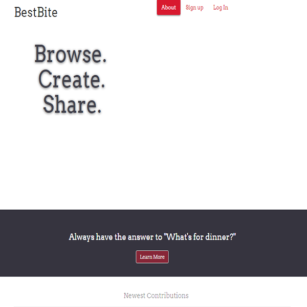

author: Theodosis Asvestopoulos
email: asvestopouli@hotmail.com

This is a help file for the html template. In order to adjust the
template to your needs two things have to be done:

1. Modify the index.html file.
2. Use your own images in the folder ./img

<hr>

In the index.html, do the following:


1. Change the <title>Portfolio Webpage</title> to <title>Your Title</title>.


2. Change the:

```html
	<ul class="dropdown menu" data-dropdown-menu>
              <li class="menu-text">Portfolio Webpage</li>
        </ul>
```
    To:

``` html
	<ul class="dropdown menu" data-dropdown-menu>
              <li class="menu-text">Your Brand</li>
        </ul>
```

3. Change the:

``` html
	<h3 id="welcome">Welcome to my portfolio webpage</h3>
        <p id="welcome_p">I am a front end developer</p>
```

    To:

``` html
	<h3 id="welcome">Welcome Message</h3>
        <p id="welcome_p">Short Description about Yourself</p>
```

4. Change the:

```html
	<a href="#" class="button" id="twitter">Follow</a>
          
        <!-- LINK TO LINKEDIN ACCOUNT -->
        <a href="#" class="button" id="linkdn">Connect</a>
          
        <!-- LINK TO GITHUB ACCOUNT -->
        <a href="#" class="button" id="github">Fork</a>
```
   So that they link to your social media (example href="www.twitter.com/profile").


5. Change the:

```html
	<h4>Front-end Developer</h4>
        <p>Hello, I am a front-end developer. I studied 
	computer science and I have experience in webpage 
	design for local businesses. I love coding...I also love my 
	pet, a golden retriever, named Sally.
        </p>
```

  To:

```html
	<h4>What you are</h4>
	<p>A more specific description about yourself.</p>
```

6. In each skill block:

```html
	<div class="row">
                  <div class="media-object-section small-12 large-6 columns">
                        <div class="success progress" role="progressbar" tabindex="0" aria-valuenow="25" aria-valuemin="0" aria-valuetext="25 percent" aria-valuemax="100">
                          <div class="progress-meter" style="width: 90%">
                            <p class="progress-meter-text">90%</p>
                          </div>
                        </div>
                </div>
                <div class="media-object-section small-12 large-6 columns">
                        <h4>HTML5</h4>
                </div>
         </div>
```
	Adjust the values in style="width: value%" and <p class="progress-meter-text">value%</p> 
	to refer to your percent of expertise.
	Change the content <h4>HTML5</h4> to <h4>Your Skill</h4>.


7. For the projects you can delete or add more blocks like this:

```html	
	<div class="column column-block">
              <a href="#"></a>
        </div>
```

    Be sure that the image src links to your image (example src="./img/yourImage.png").
    Also link each thumbnail with your project in href="link-to-your-project".


8. Add to your contact form some php action:

```html
	<section class="contact" id="contact" action="./action.php">
```

<hr>

Do the above to adjust the structure of the webpage to your needs. 
You also need to change the images in ./img folder with your images:

1. For your project thumbnails replace site[1,2,3...].png with a 600x600
    photo of your project, don't change the names, unless you modify
    the src="" attributes in the index.html

2. Replace the me.png with your profile image, under the me.png name.


